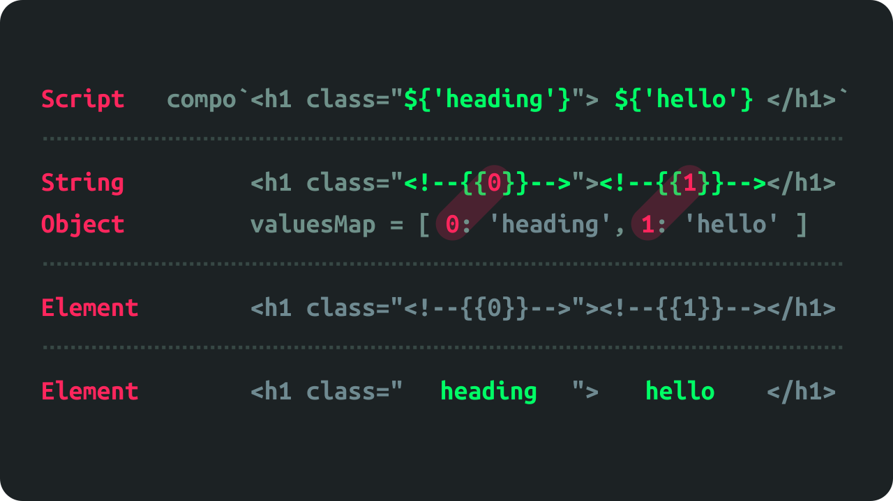

# 🍦 Сompo (draft)

Simplest vanilla JavaScript nano library for create components-based UI.

## ✋🏾 What?

In 2018+ you don't need an framework for create UI for web apps.

This **experiment** shows:

- how use modern vanilla JS in UI creating (instead of React, Vue, Backbone, JSX, VDOM...);
- how remain simple and lightweight at the same time.

*Compo* uses native Web API's and tagged template literals for define templates.



## 💪🏾 How?

```javascript
import { compo, render } from 'compo';

const Heading = text => compo`<h1 click="${() => {}}">${text}</h1>`;

render(Heading('Hello, world'), document.body);
```

*Compo* relies on values types, you passed in template attributes.

- **Strings** and **Numbers** will be passed as normal attributes;
- **Function** will be added by `addEventListener`;
- **Boolean** will be added or removed as attribute depending on the it truth.

## 🤘🏾 Next?

Ideas:

- use with **Web Components** (for nesting templates beautiful);
- patching DOM (for creating ractive UI).
